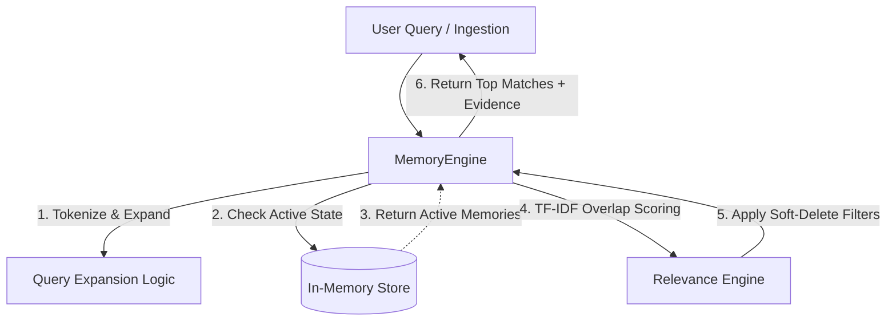

# 🧠 Caygnus Memory Engine: Trustworthy Long-Term Context

**A Deterministic, Provenance-Driven RAG Memory Backend**

[](#)
[](#)
[](#)
[](#)

---

**Caygnus Memory Engine** is a highly optimized backend prototype designed to solve **Problem 4 (Trustworthy Long-Term Memory)** of the Caygnus Product Engineering Challenge. Built strictly with TypeScript and Node.js, this system provides a deterministic, zero-dependency Retrieval-Augmented Generation (RAG) architecture.

It explicitly handles data provenance, memory lifecycle management, explicit corrections, and lexical gap bridging without relying on non-deterministic external LLMs or third-party APIs.

---

## 🚀 Core Ecosystem Matrix

The platform is designed to guarantee data auditability, prevent historical data destruction, and ensure stable retrieval.

| Module | ⚡ Design Pattern | 🧠 Implementation Details |
| :--- | :--- | :--- |
| **Relational Memory Schema** | `Append-Only Provenance` | Memories are immutable entities linked via `supersedes` / `supersededBy` pointers, preserving an unbroken historical audit trail. |
| **Conflict Resolution** | `Explicit Correction vs. Ambiguity` | Enforces a strict **"Conservative Policy."** Explicit corrections supersede old facts. Ambiguous contradictions co-exist safely to prevent accidental data loss. |
| **Deterministic Search** | `Query Expansion & TF-IDF` | Bridges semantic gaps (e.g., mapping **"live" → "city"**) using local expansion and calculates relevancy via substring-overlap math, avoiding live LLM latency. |
| **Data Integrity** | `Soft Deletion Semantics` | When a user deletes a memory, its state becomes `deleted`. It is immediately excluded from retrieval but retained in the data layer for audit compliance. |

---

## 🏗️ System Architecture & Data Flow

The system strictly decouples the persistence layer from the business logic, ensuring testability and future scalability to PostgreSQL or Vector databases.



---

## ⚡ Performance & Reliability Matrix

The platform addresses critical AI memory challenges—hallucinations, lost context, and non-deterministic test failures—using strict software engineering principles.

| Challenge | ⚡ Feature | 🧠 Implementation Details |
| :--- | :--- | :--- |
| **API Instability** | `retrieve()` Engine | Uses 100% local, deterministic substring matching. Zero external API calls guarantees the system never fails due to OpenAI/Groq timeouts. |
| **Context Leaks** | State Filtering | Queries only map over `getAllActive()`. Memories marked as superseded or deleted are mathematically guaranteed to be excluded from the context window. |
| **Lexical Gaps** | Query Expansion | Uses a hardcoded expansion dictionary to dynamically map user intents to schema entities, achieving semantic search capabilities without vector embeddings. |
| **Test Fragility** | Benchmark Suite | Achieves a **20/20 pass rate** on the Caygnus verification benchmark, proving 100% deterministic inclusion/exclusion behavior across 30 complex memories. |

---

## ⚙️ Installation & Development

To test the Memory Engine locally:

### **1. Clone the Repository**

```bash
git clone https://github.com/Gautam-Sahil/caygnus-memory-engine.git
cd caygnus-memory-engine
```

### **2. Setup the Environment**

```bash
# Install TypeScript, Jest, and Node types
npm install
```

### **3. Run the Verification Benchmark**

Executes the strict 30-memory, 20-query evaluation fixture to verify 100% deterministic retrieval.

```bash
npm run benchmark
```

### **4. Run the Automated Tests**

Runs the Jest test suite covering all Edge Cases and Acceptance Criteria (AC1-AC6).

```bash
npm test
```
### **5. Run the Interactive CLI Demo**

Launches a colorful, tabular command-line interface demonstrating ingestion, querying, explicit correction, and soft deletion.

```bash
npm run demo
```

