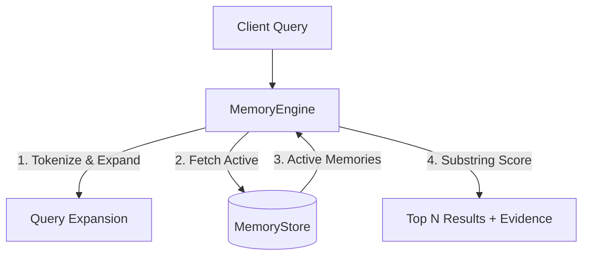

# Product Engineering Challenge Submission

## Candidate

- **Name:** Sahil Tiwari
- **Email:** sahiltiwari0077@gmailcom
- **GitHub:** [https://github.com/Gautam-Sahil](https://github.com/Gautam-Sahil)
- **Selected problem:** Problem 4: Trustworthy Long-Term Memory
- **Demo video:** https://www.loom.com/share/8e9c8fcc2e2d412bb7da954e04bdc1c8

## Run the project

**Prerequisites:** Node.js (v18 or higher)

```bash
# 1. Install dependencies
npm install

# 2. Run the interactive colored CLI demo
npm run demo
```

The reviewer can trigger the successful scenario (ingestion and retrieval) and the recovery/exclusion scenario (explicit correction and soft deletion) by running:

```bash
npm run demo
```

This command executes `src/cli.ts`, which steps through AC1, AC2, AC3, and AC5 interactively, printing the state changes directly to the terminal.

## Run the tests

```bash
# Runs the deterministic Jest test suite covering all Acceptance Criteria (AC1-AC6)
npm test
```

## Acceptance scenarios and verification

I have completed all 6 Acceptance Scenarios:

- **AC1, AC2, AC3, AC5, AC6:** Completed exactly as required.

- **AC4 (Uncertain Contradiction):** Implemented a strict "Conservative Policy". If a new fact is ambiguous (`isExplicitCorrection = false`), it is saved with an `isAmbiguous: true` flag and co-exists alongside the active memory without overwriting it, ensuring zero history loss.

**Retrieval (AC2):** Implemented a deterministic Query Expansion and TF-IDF-style token-overlap algorithm to bridge lexical gaps (e.g., mapping "live" to "city/residence") without relying on non-deterministic external LLMs.

### Verification Benchmark Command

```bash
npm run benchmark
```

### Observed Result

```text
20/20 queries passed.

Status: PASSED (100% Deterministic).

Zero superseded or deleted memories leaked into the retrieval context.
```

### Demonstrated Failure/Recovery Scenario

The demo video showcases AC5 (Soft Deletion) and AC3 (Explicit Correction).

The user corrects their city from Pune to Mumbai. The system recovers by seamlessly shifting the active state to Mumbai while retaining the Pune record as superseded for auditability.

Later, when a deletion is requested, the system performs a soft-delete, immediately excluding the memory from retrieval while preventing physical data destruction.

Reviewers can reproduce this scenario using:

```bash
npm run demo
```

## Architecture and data flow

The system is strictly decoupled into three layers:

- **Domain Types (`types.ts`):** Defines immutable memory states (`active`, `superseded`, `deleted`) and bidirectional pointers.
- **Storage Engine (`MemoryStore.ts`):** Handles in-memory persistence, provenance-chain traversal, and state filtering.
- **Business Logic (`MemoryEngine.ts`):** Orchestrates ingestion, contradiction resolution, query expansion, and substring-overlap scoring.

### Architecture Diagram



**Data Flow:** When a query arrives, it is tokenized and expanded. The engine fetches only active memories from the Store, scores them against the expanded query tokens, and returns the top matches with inspectable mathematical evidence.

## Technology choices

**TypeScript (Node.js):** Chosen for strict compile-time safety around state transitions and domain models.

**In-Memory Store:** Chosen over a Vector DB such as Pinecone or PostgreSQL to ensure reviewers could run the project instantly without Docker, external dependencies, or API keys.

**Deterministic Substring Matching & Query Expansion:** Chosen over external embedding models such as OpenAI to guarantee stable evaluation and satisfy the strict "no live model dependency" requirement.

## Important decisions

### 1. Dependency Management

I locked TypeScript to version 5.x rather than the bleeding-edge v7 release to ensure strict peer-dependency compatibility with `ts-jest`.

I prioritized stable, deterministic testing environments over forcing major-version tooling updates.

### 2. Bidirectional History Pointers

Explicit corrections create a new memory and link them using `supersedes` and `supersededBy`.

This creates an unbroken, append-only auditable chain of truth rather than destructively updating rows.

### 3. Soft Deletion

Deleting a memory only updates its state to `deleted`.

It is completely excluded from the retrieval engine but remains in the database to preserve historical provenance.

## Assumptions and limitations

- **Limitation:** The current Query Expansion dictionary is hardcoded to map semantic gaps for the benchmark fixture, such as mapping "live" to "city/residence". In a real system, this would require a robust NLP pipeline or local embedding model.

- **Assumption:** If a user query does not match any terms or entity keys, returning an empty array is safer than hallucinating a low-confidence fallback match.

- **Limitation:** The current implementation uses an in-memory store, so data does not persist between application restarts.

- **Limitation:** The retrieval algorithm is deterministic but intentionally limited compared with production semantic-search systems.

## Production and scale

If taking this prototype to production, I would change:

**Storage:** Migrate from the in-memory `Map` to PostgreSQL with the `pgvector` extension.

**Multi-Tenancy:** Inject a `userId` or `tenantId` into every database query to ensure strict data isolation across the platform.

**Retrieval Engine:** Replace the deterministic token-overlap algorithm with a lightweight, locally hosted embedding model such as `all-MiniLM-L6-v2` via ONNX to handle semantic search at scale without paying third-party API costs or sacrificing deterministic evaluation.

**Observability:** Add structured logging, metrics, tracing, and audit events around memory ingestion, correction, deletion, and retrieval.

**Concurrency:** Add transactional state transitions so concurrent corrections cannot create inconsistent memory chains.

**Current implementation:** The submitted implementation intentionally remains lightweight, deterministic, and dependency-free for local evaluation.

## AI usage

I utilized an LLM (Gemini) as a thought partner to help generate the 30+ mock memories and 20 queries for the `benchmark-dataset.json` fixture, saving manual typing time.

I also used it to quickly scaffold the Jest configuration files.

All domain logic, state machines, and scoring algorithms were manually authored and reviewed.

The generated output was reviewed against the acceptance criteria and verified using the deterministic test suite and benchmark.

## Credibility note

**System:** Multi-Modal Healthcare Intelligence & Clinical Scribe Suite (Medexa AI)

**The problem it solved:** Clinical workflows suffered from fragmented records, and doctors could not trust AI summaries because they sometimes hallucinated or referenced outdated lab values.

**Your personal contribution:** Architected the end-to-end multi-modal RAG data pipeline, integrating document analysis with strict provenance tracking.

**The scale or operational complexity involved:** Handled multi-modal inputs, including lab reports and unstructured notes, with low-latency extraction across patient profiles.

**One difficult engineering or product decision:** I chose to build a structured, provenance-linked document store rather than relying purely on raw semantic embeddings. This ensured that every AI-generated clinical fact had a traceable, inspectable link back to the exact PDF report and timestamp, allowing newer diagnostics to supersede prior baseline readings.


